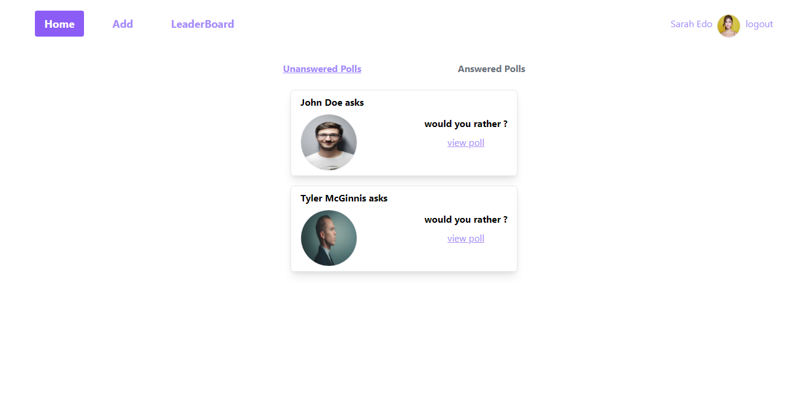

# My Reads

---



## Description

---

with this app the user can log in and:

-see thier answered and unanswered questions

-add new questions

-answer a question

-see thier score on the leaderboard

## Getting Started

1. move to the project directory

2. run

```
npm install
```

3. run

```
npm start
```
